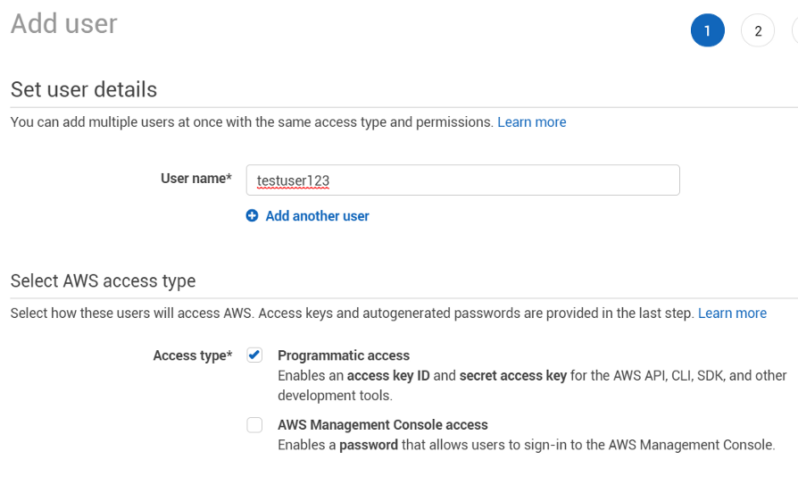
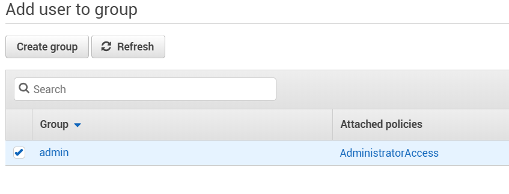
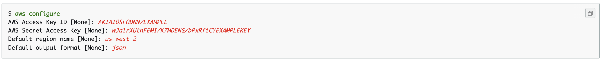

[](https://www.npmjs.com/package/create-aws-tf-lambda) [](https://github.com/julekgwa/aws-terraform-lambda-generator) [](https://unpkg.com/create-aws-tf-lambda/dist/index.js) 


# Installation

```bash
npm i create-aws-tf-lambda -g
```

or

```bash
yarn global add create-aws-tf-lambda
```

# Setup AWS Account
<details>

  1. Create a new user in the IAM Section on AWS [here](https://console.aws.amazon.com/iam/home?region=us-east-1#/users).
  2. Select Programmatic access below and enter your user details.

   

  3. Click next and select the admin group.

   

  4. Continue with the steps until you reach the Create User section and confirm the user has been created. Once the user is created you will get an Access key ID and Secret access key.
  5. Open terminal and run ```$ aws configure```. Paste access key id and secret access key from step 4

  

   or create a file called instance.tf with the following code.

   ```
   provider "aws" {
    access_key = "ACCESS_KEY_HERE"
    secret_key = "SECRET_KEY_HERE"
   }
   ```

</details>

# Install terraform
Download Terraform [here](https://www.terraform.io/downloads.html) and follow the guide [here](https://www.terraform.io/intro/getting-started/install.html) on how to install Terraform on your specific system.

# Usage

To create a new lambda run the following command
```bash
create-aws-tf-lambda
```

# Optional Arguments

| Argument           | Description            ||
|----------------|-------------------------------------------------------------------------------------------------------|---|
| -n, --new      | Creates a new project
| -a, --add        | Adds a new lambda. Use -a sfn to add a step function
| -h, --help       | Prints the usage guide
| -o, --org | Moves all your lambdas to one project [mono project]


# License

MIT